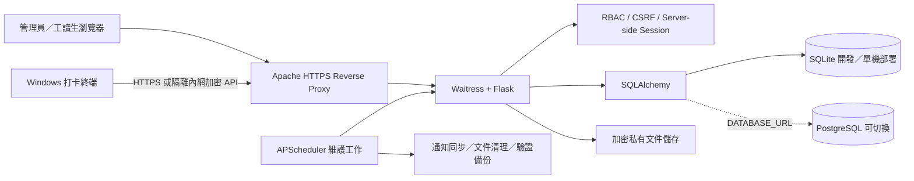

# 大專校院宿舍工讀生系統

> Dormitory Student Worker Management System — 整合排班、出勤、請假換班、證件、薪資試算、報表與安全稽核的校務管理平台。


本專案將宿舍工讀生管理原本分散於紙本、Excel 與通訊軟體的流程，整理為一套具備角色權限、資料庫交易、操作稽核與安全文件保存機制的 Flask 系統。管理員可在同一平台完成排班、出勤核對、人力需求、證件審核、薪資試算與月報匯出；工讀生則可透過電腦或手機查看班表、申請請假或換班、回報出勤異常及維護個人文件。

介面以繁體中文為主、英文為輔；排班核心延續原始 `main.html` prototype 的 FullCalendar 操作概念，並將帳號、權限、驗證與資料一致性移至後端處理。

## 目錄

- [系統特色](#系統特色)
- [角色與功能](#角色與功能)
- [核心業務規則](#核心業務規則)
- [系統架構](#系統架構)
- [快速開始](#快速開始)
- [正式部署](#正式部署)
- [安全與隱私](#安全與隱私)
- [備份與復原](#備份與復原)
- [測試](#測試)
- [專案結構](#專案結構)
- [主要更新沿革](#主要更新沿革)
- [文件索引](#文件索引)
- [授權與使用責任](#授權與使用責任)

## 系統特色

| 模組 | 已實作能力 |
| --- | --- |
| 排班管理 | FullCalendar 月曆／清單、動態地點泳道、地點與班別 CRUD、單筆與每週重複排班、CSV 批量匯入、批量刪除、草稿與正式發布、月份排班鎖定 |
| 排班檢核 | 人員時段重疊、同地點多人二次確認、每日工時、連續工作天數、可設定週界線與每週時數限制、例外國籍與不限時數期間、可排／不可排時段提醒 |
| 請假與換班 | 申請人原因必填、同儕回覆、管理員最終審核、衝突預檢、交易式核准、狀態歷程與月曆標示 |
| 出勤管理 | 固定地點打卡終端、學生證 UID／帳號打卡、離線佇列、漏刷與遲到事由、管理員核對、確認計薪時數 |
| 人力配置 | 學生群組、缺員／人力需求、指定全部學生／群組／個別學生開放、申請與核准 |
| 帳號與名冊 | 多管理員、工讀生帳號、臨時密碼、首次登入強制改密碼、名冊多欄排序、帳號封存與復原 |
| 證件管理 | 外籍生居留證正反面、工作證 1–2 頁、加密私有保存、管理員欄位與影像併同審核、退回補件、效期提醒、保存期限與排程清理 |
| 薪資與報表 | 即時工時／薪資試算、有效日最低工資、勞健保與雇主成本設定、月報、每日時數矩陣、排班／薪資／流程／證件報表 CSV 或 XLSX |
| 通知中心 | 以「未完成／已完成」管理，不以已讀取代完成；儀表板刷新即時核對，背景維護補充定期同步 |
| 維運與稽核 | 來源 IP、User-Agent、route、動作與安全摘要、設定前後差異、自動驗證備份、隔離式復原演練、Windows Launcher 與 Watchdog |

> OCR 已依實際使用需求移除。證件資料由工讀生對照完整影像填寫，再由管理員人工核對，系統不會以辨識結果自動覆寫正式資料。

## 角色與功能

### 管理員 Admin

- 從儀表板優先查看待辦通知、證件效期、今日與明日值班資訊。
- 建立、編輯、發布、匯入、重複安排或批量刪除排班。
- 管理動態工作地點、班別、國籍、排班政策與最低工資生效資料。
- 審核請假、換班、缺員申請、證件與出勤異常。
- 維護學生群組、工讀生及其他管理員帳號，並封存或復原帳號。
- 核對排班時數、出勤結果與計薪時數，匯出管理報表。
- 查詢安全事件、操作稽核、設定變更差異、備份及復原演練結果。

### 工讀生 Student

- 首頁查看近期 5 筆排班、本月時數、薪資試算與未完成提醒。
- 月曆預設顯示「我的班表」，也可查看其他工讀生已發布的公開班表；草稿不會曝光。
- 提出請假、承接或互換班別，並追蹤同儕與管理員處理進度。
- 填寫可排班／不可排班時段；若管理員排入衝突時段，系統提醒但允許管理員確認後繼續。
- 查看可申請的缺員需求、送出或取消申請。
- 維護聯絡資料、修改密碼、上傳個人證件及查看退回原因。
- 登錄學生證、查看個人出勤、填寫遲到或漏刷原因。

### 打卡終端 Attendance Terminal

- 以獨立 Windows 程式連接鍵盤模擬讀卡機，支援學生證與在線帳號打卡。
- 使用 Windows DPAPI 保護本機設定與離線佇列；帳號密碼不落地。
- HTTPS 模式支援短效註冊碼；隔離內網的 `ENCRYPTED_HTTP` 模式使用一次性、限時且受密碼保護的 `.dormclock` 註冊包。
- 每台裝置採獨立密鑰與 AES-256-GCM 請求／回應保護，並驗證時間、request ID、裝置狀態與選配 CIDR。
- 回報電腦名稱與網路介面識別資料供管理員核對；MAC 位址僅作輔助識別，不能視為不可偽造的身分憑證。

詳細安裝方式請見 [打卡終端說明](attendance-terminal/README.md)。

## 核心業務規則

### 排班

- 同一工讀生不可出現在重疊時段。
- 同一地點、同一時段可安排多人，但管理員必須明確二次確認。
- 單一班別及每日合計不得超過 8 小時；連續工作不得超過 5 天。
- 每週工時限制可完全開關，週起始日、上限、適用國籍、例外國籍與寒暑假等不限時數期間均可由管理員設定。
- 「法規每週限制」與「薪資」皆以班別實際設定時數為準，不以畫面文字推算。
- 每週重複系列採全有或全無交易；可刪除單筆、本筆及後續，或整個系列。
- 新排班可先保存為草稿；學生端及正式班表只顯示已發布排班。
- 月份鎖定只限制該月排班異動，不與薪資結算綁定；薪資會依已發布排班與已確認計薪時數即時更新。
- 所有關鍵驗證由後端執行；前端提示只用於改善操作體驗。

### 請假與換班

- 申請者必須填寫請假或換班原因；被邀請承接／交換的對象不需另填原因。
- 學生送出換班、受邀者接受及管理員核准時都會重新檢查班表所有權與衝突。
- 核准請假不會靜默刪除歷史排班，而是保留申請與缺員狀態。
- 換班核准以單一資料庫交易更新，任何步驟失敗都不留下半套資料。

### 外籍生文件

- 需要文件的國籍由管理員維護，不預設任何國籍一定適用或一定例外。
- 居留證需上傳正面及反面；工作證第 1 頁必填、第 2 頁選填。
- 工讀生完成必要文件上傳後即可使用系統，不需等待管理員核准；審核狀態與補件要求仍會持續顯示於通知中心。
- 管理員審核居留證時須核對證號與截止日；審核工作證時須核對開始日與截止日。
- 退回必須填寫原因，工讀生修正後可重新送審。

### 工時與薪資

- 預設以班別設定時數計算；已有管理員確認的出勤計薪時數時，以確認值為準。
- 最低工資使用具生效日的資料表，讓跨年度排班依當時有效標準計算。
- 管理員可設定時薪、投保級距及雇主負擔費率；工讀生只看到個人預估稅前工資。
- 學生端金額明確標示為「尚未扣除勞健保之試算參考」，不得取代正式薪資單或主管機關申報結果。

## 系統架構



| 層級 | 技術與設計 |
| --- | --- |
| Backend | Python、Flask、Blueprint、Jinja2、service modules |
| Authentication | Flask-Login、伺服器端 session、Argon2 密碼雜湊 |
| Data | SQLAlchemy、Flask-Migrate／Alembic、SQLite；可由 `DATABASE_URL` 切換 PostgreSQL |
| Frontend | Bootstrap 5、Bootstrap Icons、FullCalendar、Vanilla JavaScript；第三方靜態檔已置於本機 |
| Scheduling | APScheduler 執行通知、文件清理與備份維護工作 |
| Production | Windows、Waitress、XAMPP Apache reverse proxy、Launcher、Watchdog |
| Testing | pytest，涵蓋權限、排班、工作流程、文件、報表、打卡、安全及部署 |

## 快速開始

### 開發環境需求

- Windows PowerShell
- Python 3
- Git

```powershell
git clone https://github.com/MiniDora1122/yzudorm-staff-system.git
Set-Location yzudorm-staff-system

py -3 -m venv .venv
.\.venv\Scripts\Activate.ps1
python -m pip install --upgrade pip
python -m pip install -r requirements-dev.txt

Copy-Item .env.example .env
# 開啟 .env，至少替換 SECRET_KEY；正式環境另須檢查所有安全設定。

python -m flask --app wsgi.py db upgrade
python -m flask --app wsgi.py seed
python -m flask --app wsgi.py run --debug
```

瀏覽器開啟 <http://127.0.0.1:5000>。

### Demo 帳號（僅限開發）

| 角色 | 帳號 | 密碼 |
| --- | --- | --- |
| 管理員 | `admin` | `AdminDemo!2026` |
| 工讀生 | `student1` | `StudentDemo!2026` |
| 工讀生 | `student2` | `StudentDemo!2026` |

正式環境不得執行 demo seed，也不得沿用上述帳號或密碼。

### Windows 圖形化啟動

不熟悉命令列的部署者可使用 `portable-windows-launcher/DormStaffLauncher.exe` 完成環境檢查、資料庫 migration、首次管理員建立、啟停服務、安全更新及備份。第一次使用前請閱讀 [Launcher 首次使用說明](portable-windows-launcher/FIRST_USE.md)。

## 正式部署

正式環境建議使用：

```text
Client ──HTTPS──> XAMPP Apache ──loopback──> Waitress ──> Flask
```

- 不要使用 Flask development server 對外服務。
- Waitress 應只監聽 loopback，由 Apache 提供 HTTPS、反向代理及 forwarded headers。
- 只有在代理無法被繞過、且 Apache 會覆寫外部 forwarded headers 時，才能啟用 `TRUST_PROXY`。
- 純 HTTP 無法防止帳密或 Cookie 被同網段攔截；若暫時沒有憑證，只能在隔離且受信任的內網使用，並依指南套用最嚴格的可行限制。
- `instance/`、資料庫、文件、密鑰、備份與 `.env` 不得提交至 Git。

完整步驟：

- [Windows／XAMPP 正式部署](deployment/DEPLOYMENT_WINDOWS_XAMPP.md)
- [XAMPP、X-Forwarded-For 與 HTTP 安全設定](portable-windows-launcher/XAMPP_GUIDE.md)
- [Private Git 安全更新與失敗復原](deployment/GIT_UPDATE_GUIDE.md)
- [HTTP 搬移與 seed 復原](deployment/HTTP_MIGRATION_AND_SEED_RECOVERY_ZH_TW.md)

## 安全與隱私

- 密碼使用 Argon2 雜湊，不儲存或記錄明文密碼。
- 登入成功後更換 server-side Session ID；Cookie 使用 `HttpOnly`、`SameSite`，正式 HTTPS 環境啟用 `Secure`。
- 登入失敗依帳號與來源 IP 套用時間窗限流。
- 所有狀態變更請求均有 CSRF 防護；ADMIN／STUDENT 權限由後端強制驗證。
- 回應包含 CSP 與其他安全標頭；正式部署仍須由 HTTPS 提供傳輸層保護。
- 稽核記錄保存時間、操作者、IP、User-Agent、HTTP method、route、動作、安全摘要及設定前後差異。
- 完整證號、密碼、OCR 原文與證件影像不寫入 application log 或 audit log。
- 證件移除 EXIF、重新編碼後以 Fernet 加密，保存於非 `static` 私有路徑；下載時重新驗證登入者與權限。
- 文件主金鑰與備份不一致時拒絕啟動，避免使用錯誤金鑰造成不可逆資料損失。
- 打卡裝置的 IP、電腦名稱及 MAC 僅作裝置核對線索；任何單一網路識別值都不能取代密鑰驗證。

安全相關環境變數與建議值請以 [.env.example](.env.example) 及 [.env.production.example](.env.production.example) 為準。

## 備份與復原

- 管理員可選擇「每隔 1–168 小時」或「每天固定時間」自動備份。
- SQLite 使用 online backup API 產生一致性快照，並與應用程式內文件異動協調，降低資料庫與文件跨時間點不一致的風險。
- 備份完成後驗證 manifest、每個檔案的 SHA-256、SQLite `PRAGMA integrity_check`。
- 額外逐筆確認 `StaffDocument.storage_key` 的檔案存在、可解密，且解密內容雜湊符合 metadata。
- 復原演練會在隔離暫存目錄解壓、驗證 migration／資料庫與加密文件，不覆寫正式資料。
- 備份結果、驗證錯誤與演練結果可由管理員查詢並留存稽核。

手動執行備份：

```powershell
python -m flask --app wsgi.py backup-run --actor-user-id 1
```

正式環境應將 `AUTOMATIC_BACKUP_DIR` 設於另一顆受保護磁碟或外部備份系統。同一硬碟內的副本只能處理誤刪，無法防範磁碟故障、勒索軟體或整機遺失。

## 測試

```powershell
python -m pytest -q
```

測試套件涵蓋：

- 登入、Session、限流、RBAC、CSRF 與稽核。
- 單筆／重複／匯入排班及各類工時、衝突與併發保護。
- 請假、換班、通知、學生群組、缺員與月份鎖定。
- 證件權限、加密、清理、備份完整性及復原演練。
- 出勤終端、離線事件、裝置管理、核對與計薪時數。
- 月報、每日時數表、薪資與其他匯出內容。
- Windows 部署、Launcher、Watchdog 與資料搬移腳本。

每次更新建議至少執行：

```powershell
python -m pip install -r requirements-dev.txt
python -m flask --app wsgi.py db upgrade
python -m pytest -q
```

正式環境更新請優先使用 Launcher 或 [安全更新流程](deployment/GIT_UPDATE_GUIDE.md)，讓更新前備份、migration、測試及失敗回復依固定順序執行。

## 專案結構

```text
.
├─ app/
│  ├─ admin/              # 管理員路由：排班、出勤、報表、設定與維運
│  ├─ attendance_api/     # 打卡裝置 API
│  ├─ auth/               # 登入、登出與密碼流程
│  ├─ services/           # 排班、通知、備份、文件、薪資等業務服務
│  ├─ student/            # 工讀生功能
│  ├─ templates/          # Jinja2 中英雙語介面
│  └─ static/             # CSS、JavaScript 與本機 vendor assets
├─ attendance-terminal/   # Windows 打卡終端與建置／更新腳本
├─ deployment/            # XAMPP、Waitress、備份、復原與更新工具
├─ migrations/            # Alembic database migrations
├─ portable-windows-launcher/
│                         # 圖形化安裝、啟動、維護與 watchdog
├─ tests/                 # pytest 測試套件
├─ main.html              # 原始排班 prototype，保留作 UX 與規則參考
├─ config.py              # 環境設定
├─ requirements*.txt      # 正式／開發相依套件
└─ wsgi.py                # WSGI entry point
```

業務邏輯集中於 `app/services/`，route 主要負責 HTTP 輸入、權限與回應；新增資料結構須透過 Alembic migration，避免以啟動時臨時改表的方式維護 schema。

## 主要更新沿革

以下整理 repository 中的重要開發節點；完整逐筆內容、檔案差異與 commit 作者仍以 [GitHub commit history](https://github.com/MiniDora1122/yzudorm-staff-system/commits/main/) 為準。

| 日期 | 版本節點 | 主要內容 |
| --- | --- | --- |
| 2026-08-24 | 目前版本 | Session 固定攻擊防護、登入限流、安全回應標頭、時區篩選修正、通知同步分流、SQLite 寫入協調、一致性備份與文件可解密驗證、復原演練、有效日最低工資、可排班時段、出勤核對與計薪時數、月份結束檢查清單 |
| 2026-08-23 | [`3e5b41b`](https://github.com/MiniDora1122/yzudorm-staff-system/commit/3e5b41b) | 修正自動備份；新增一次性限時打卡註冊包、裝置網路介面識別與打卡流程調整 |
| 2026-08-20 | [`99f45f4`](https://github.com/MiniDora1122/yzudorm-staff-system/commit/99f45f4) | 修正代理來源 IP 判定並加入上下班打卡功能 |
| 2026-08-18 | [`5fd039b`](https://github.com/MiniDora1122/yzudorm-staff-system/commit/5fd039b) | 改善管理員與學生班表顯示、日期資訊及已發布班表瀏覽 |
| 2026-08-17 | [`c83272f`](https://github.com/MiniDora1122/yzudorm-staff-system/commit/c83272f) | 將請假與換班申請者原因設為必填 |
| 2026-08-14 | [`77f13a5`](https://github.com/MiniDora1122/yzudorm-staff-system/commit/77f13a5) | 改善每週重複排班連續新增體驗並修正稽核時間顯示 |
| 2026-08-13 | [`2b28771`](https://github.com/MiniDora1122/yzudorm-staff-system/commit/2b28771) | 修正已刪除地點仍殘留月曆及無法重新建立的問題 |
| 2026-08-13 | [`8ff41f7`](https://github.com/MiniDora1122/yzudorm-staff-system/commit/8ff41f7) | 修正既有功能與介面問題 |
| 2026-08-13 | [`eaf7db1`](https://github.com/MiniDora1122/yzudorm-staff-system/commit/eaf7db1) | 調整薪資即時計算及外籍生必要文件上傳後的系統使用規則 |
| 2026-08-13 | [`112f945`](https://github.com/MiniDora1122/yzudorm-staff-system/commit/112f945) | 修正功能整合後的已知問題 |
| 2026-08-13 | [`3762fa4`](https://github.com/MiniDora1122/yzudorm-staff-system/commit/3762fa4) | 新增草稿／發布排班、帳號封存復原、自動備份、學生群組、缺員需求、月份排班鎖定及 Git 更新保護 |
| 2026-08-13 | [`9b3efba`](https://github.com/MiniDora1122/yzudorm-staff-system/commit/9b3efba) | 改善 Windows Launcher 安裝、啟動與更新操作 |
| 2026-08-13 | [`0853d06`](https://github.com/MiniDora1122/yzudorm-staff-system/commit/0853d06) | 新增名冊欄位排序、可設定每週時數限制與 Launcher 自動啟動 |
| 2026-08-12 | [`5c74b09`](https://github.com/MiniDora1122/yzudorm-staff-system/commit/5c74b09) | 新增系統搬移工具並修復既有問題 |
| 2026-08-12 | [`8f477d2`](https://github.com/MiniDora1122/yzudorm-staff-system/commit/8f477d2) | 新增管理員安全事件與操作稽核查詢 |
| 2026-08-12 | [`65543ef`](https://github.com/MiniDora1122/yzudorm-staff-system/commit/65543ef) | 補充系統總覽、功能及部署說明 |
| 2026-08-11 | [`032da95`](https://github.com/MiniDora1122/yzudorm-staff-system/commit/032da95) | 新增未完成／已完成通知中心、證件管理員審核與每日時數矩陣報表 |
| 2026-08-11 | [`9afa640`](https://github.com/MiniDora1122/yzudorm-staff-system/commit/9afa640) | 建立可部署的 Flask／SQLAlchemy 基礎系統與核心排班、工作流程、文件及報表功能 |

### 版本管理原則

- README 記錄目前能力與重要里程碑；逐筆程式差異以 Git commit 為準。
- Database schema 變更必須附 migration。
- 功能提交前應執行測試，commit message 應說明「改了什麼」及必要的相容性注意事項。
- 正式資料、機密、備份、輸出報表與執行檔建置暫存不得進入版本控制。
- 建議後續發布穩定版本時建立 Git tag／GitHub Release，並將面向部署者的破壞性變更整理於 release notes。

## 文件索引

| 文件 | 適用情境 |
| --- | --- |
| [AGENTS.md](AGENTS.md) | 專案規則、角色權限、資料安全與開發原則 |
| [CODEX_TASK.md](CODEX_TASK.md) | 原始分階段功能規格與驗收方向 |
| [Launcher 首次使用](portable-windows-launcher/FIRST_USE.md) | Windows 圖形化安裝、首次管理員與基本操作 |
| [Windows／XAMPP 正式部署](deployment/DEPLOYMENT_WINDOWS_XAMPP.md) | Waitress、Apache、排程、備份及搬移 |
| [XAMPP 安全與代理設定](portable-windows-launcher/XAMPP_GUIDE.md) | HTTPS／HTTP 邊界、X-Forwarded-For、來源 IP 與網路配置 |
| [Private Git 更新指南](deployment/GIT_UPDATE_GUIDE.md) | clone、pull、更新前備份、migration、測試與失敗復原 |
| [打卡終端](attendance-terminal/README.md) | 終端安裝、註冊、離線佇列、加密模式與故障排除 |
| [第三方來源與授權](portable-windows-launcher/THIRD_PARTY_SOURCES.md) | Launcher 使用的第三方元件來源與授權資訊 |

## 授權與使用責任

本 repository 目前未提供獨立的開源授權檔案。除非專案擁有者另行書面授權，不應假設可自由重製、散布或商業使用。

薪資、勞健保、工時及外籍生工作規則屬管理輔助與試算功能。正式使用前，校方仍須依最新法規、主管機關資料、校內人事規章與個資保存政策完成覆核；系統輸出不能取代正式薪資單、投保申報或法律意見。
